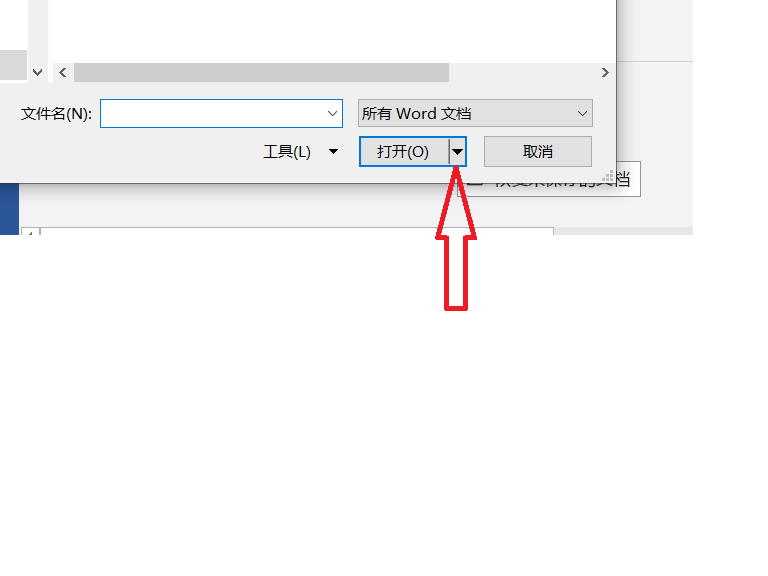
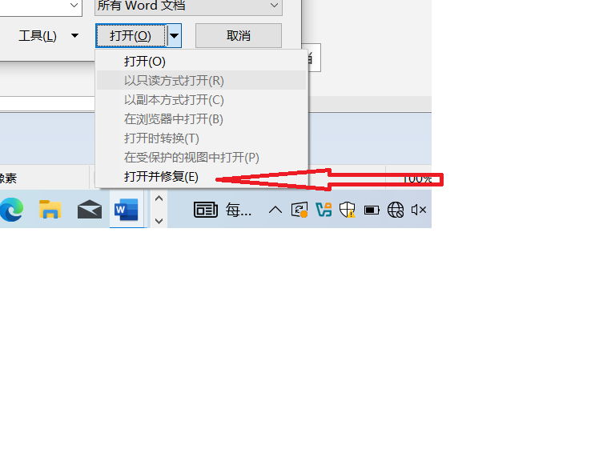

# bugs
```
遇到的一些bug，在github中可以不用操心SEO，有利于检索，而且不需要维护个人博客
```


使用python 的 python-docx 打开文件时报错
报错命令在这一行

```
from docx import Document  
doc = Document(input_file)
```
信息
```
/firgk/Desktop/myenv/bin/python /home/firgk/Desktop/myenv/a.py
Traceback (most recent call last):
  File "/home/firgk/Desktop/myenv/a.py", line 75, in <module>
    process_table_text_in_word(input_file, output_file)
  File "/home/firgk/Desktop/myenv/a.py", line 43, in process_table_text_in_word
    doc = Document(input_file)
          ^^^^^^^^^^^^^^^^^^^^
  File "/home/firgk/Desktop/myenv/lib/python3.11/site-packages/docx/api.py", line 27, in Document
    document_part = cast("DocumentPart", Package.open(docx).main_document_part)
                                         ^^^^^^^^^^^^^^^^^^
  File "/home/firgk/Desktop/myenv/lib/python3.11/site-packages/docx/opc/package.py", line 127, in open
    pkg_reader = PackageReader.from_file(pkg_file)
                 ^^^^^^^^^^^^^^^^^^^^^^^^^^^^^^^^^
  File "/home/firgk/Desktop/myenv/lib/python3.11/site-packages/docx/opc/pkgreader.py", line 25, in from_file
    sparts = PackageReader._load_serialized_parts(
             ^^^^^^^^^^^^^^^^^^^^^^^^^^^^^^^^^^^^^
  File "/home/firgk/Desktop/myenv/lib/python3.11/site-packages/docx/opc/pkgreader.py", line 53, in _load_serialized_parts
    for partname, blob, reltype, srels in part_walker:
  File "/home/firgk/Desktop/myenv/lib/python3.11/site-packages/docx/opc/pkgreader.py", line 86, in _walk_phys_parts
    for partname, blob, reltype, srels in next_walker:
  File "/home/firgk/Desktop/myenv/lib/python3.11/site-packages/docx/opc/pkgreader.py", line 81, in _walk_phys_parts
    blob = phys_reader.blob_for(partname)
           ^^^^^^^^^^^^^^^^^^^^^^^^^^^^^^
  File "/home/firgk/Desktop/myenv/lib/python3.11/site-packages/docx/opc/phys_pkg.py", line 83, in blob_for
    return self._zipf.read(pack_uri.membername)
           ^^^^^^^^^^^^^^^^^^^^^^^^^^^^^^^^^^^^
  File "/usr/lib/python3.11/zipfile.py", line 1517, in read
    return fp.read()
           ^^^^^^^^^
  File "/usr/lib/python3.11/zipfile.py", line 940, in read
    buf += self._read1(self.MAX_N)
           ^^^^^^^^^^^^^^^^^^^^^^^
  File "/usr/lib/python3.11/zipfile.py", line 1044, in _read1
    self._update_crc(data)
  File "/usr/lib/python3.11/zipfile.py", line 972, in _update_crc
    raise BadZipFile("Bad CRC-32 for file %r" % self.name)
zipfile.BadZipFile: Bad CRC-32 for file 'word/media/image13.jpeg'
```
这是word文件损坏了，常见于扫描的word文档


损坏的word文件，用word2021打开显示兼容性模式，解压word，发现中内嵌的图片显示CRC错误
```
C:\Users\firgk\Desktop\4、方剂学.docx
CRC 校验失败 : word\media\image86.jpeg
CRC 校验失败 : word\media\image47.jpeg
CRC 校验失败 : word\media\image91.jpeg
CRC 校验失败 : word\media\image22.jpeg
CRC 校验失败 : word\media\image73.jpeg
CRC 校验失败 : word\media\image8.jpeg
CRC 校验失败 : word\media\image85.jpeg
CRC 校验失败 : word\media\image36.jpeg
CRC 校验失败 : word\media\image42.jpeg
```


解决方法：
修复word文档




例子


